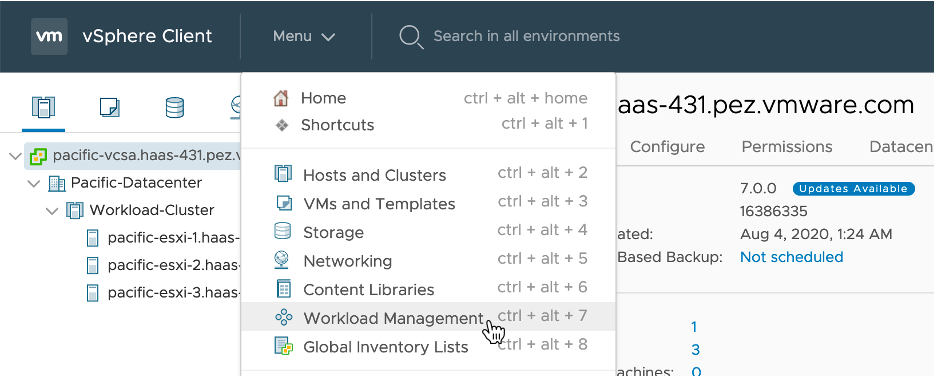
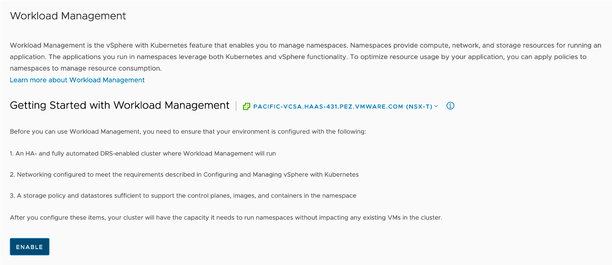
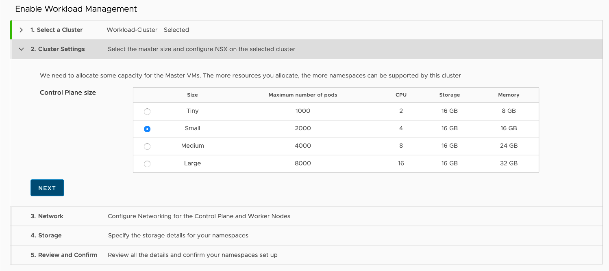
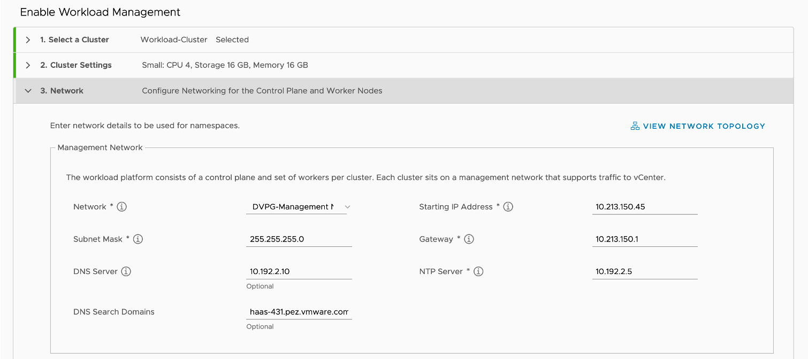
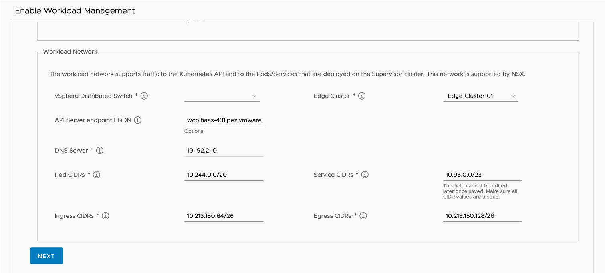
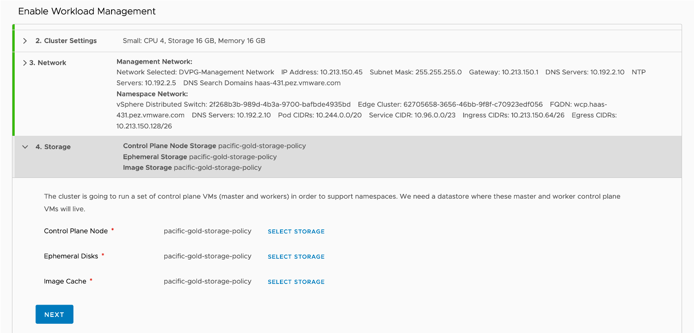
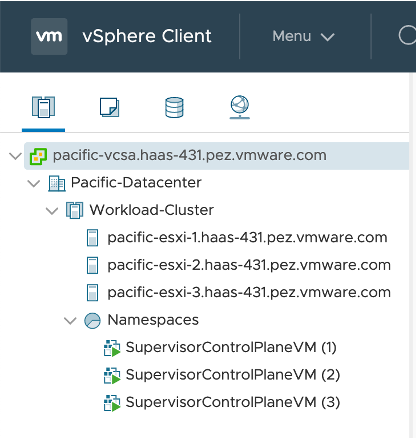

# "1. Supervisor Cluster 활성화"

### Supervisor Cluster 활성화하기

- [Menu] > [Workload Management] 메뉴로 이동합니다.
  
 

- Workload Management를 활성화하기 위해 [ENABLE] 클릭

  

- 활성화할 대상 vSphere Cluster를 선택합니다.
  

- 사용할 Pod 갯수에 따라 Supervisor Cluster의 MasterNode VM 크기를 선택합니다.
  

- Management Network
  * 각자의 환경에 맞는 MasterNode, WorkderNode가 위치할 네트워크 정보를 입력합니다.
    

- Workload Network
  * Kubernetes API, Pod/Service 관련 네트워트 정보를 입력합니다.
    
    + Pod CIDR: Pod에 부여될 IP 대역
    + Service CIDR: ClusterIP 타입의 Kubernetes 서비스에 부여될 IP 대역
    + Ingress CIDR: LoadBalancer 타입의 Kubernetes 서비스 또는 Ingress 에 부여될 IP 대역
    + Egress CIDIR: Pod에서 외부로 나가는 네트워크를 위해 NAT 규칙에서 부여될 IP 대역

- Storage
  * MasterNode, WorkerNode가 사용할 Storage를 지정합니다.
  

- Review and Confirm

- 생성된 클러스터 정보에서 API Server endpoint FQDN의 IP를 생성된 Control Plane Node IP로 DNS에 등록합니다.
  * 예) wcp.haas-431.pez.vmware.com: 10.213.150.65
    

- 구성 완료
  * 트리 메뉴에서 그림과 같이 SupervisorControlPlaneVM(MasterNode)가 생성된 것을 볼 수 있습니다.
  