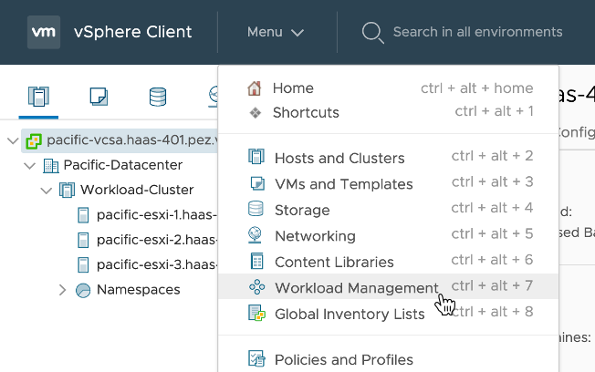
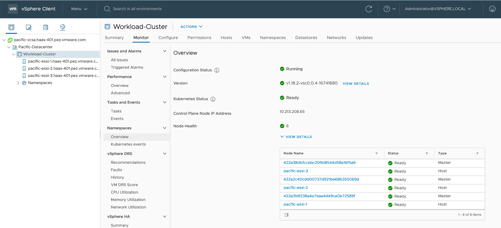
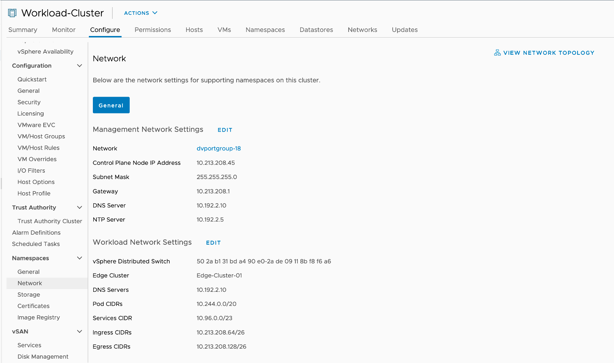

### 환경 점검
- [Menu] > [Workload Management] 메뉴로 이동합니다.

  

#### 클러스터 상태 확인
- [Cluster] 탭을 클릭합니다.
  * Tanzu(Kubernetes)가 활성회된 vSphere Cluster를 볼 수 있습니다.

  
  
- 클러스터 이름을 클릭합니다.

#### Supervisor Cluster 상태 확인
- [Monitor] 탭 > Namespaces > [Overview] 클릭
  * Supervisor 클러스터의 상태, Kubernetes 버전 등을 확인 할 수 있습니다.

- [Node Health] 아래 [VIEW DETAILS]를 클릭
  * Master Node로 생성된 SupervisorControlVM 3개가 있고 ESXI 호스트가 Worker Node 역할을 하는 것을 볼 수 있습니다.

    

- [Configure] 탭 > Namespaces > [General] 클릭
  * Control Plane VM이 좌측 트리에서 보는 3개를 사용하고 있는 것을 볼수 있습니다.

      

#### Supervisor Cluster 네트워크 확인
- [Configure] 탭 > Namespaces > [Network] 클릭
  * Workload Management Enable시 입력한 네트워크 정보를 볼 수 있습니다.

    

- Workload Network Settings
  * Pod CIDR: Pod에 부여될 IP 대역
  * Service CIDR: ClusterIP 타입의 Kubernetes 서비스에 부여될 IP 대역
  * Ingress CIDR: LoadBalancer 타입의 Kubernetes 서비스 또는 Ingress 에 부여될 IP 대역
  * Egress CIDIR: Pod에서 외부로 나가는 네트워크를 위해 NAT 규칙에서 부여될 IP 대역