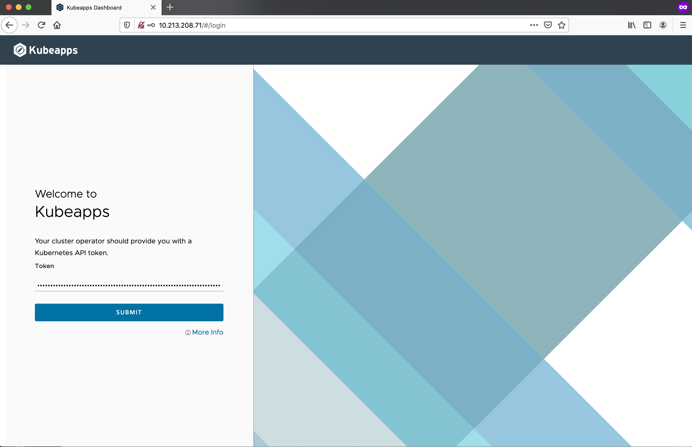
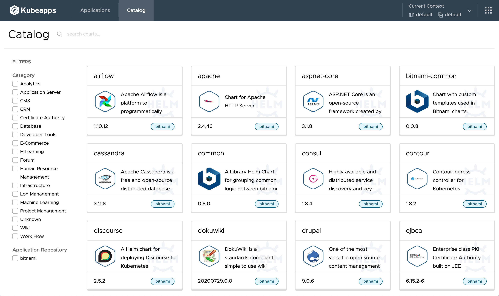

## 1. Kubeapps 설치

### Helm 설치
바이너리 설치
- 다운로드
  * https://github.com/helm/helm/releases

- 압축해제
  * 예) tar -zxvf helm-v3.0.0-linux-amd64.tar.gz

- 설치
  * 예) mv linux-amd64/helm /usr/local/bin/helm

```
$ wget https://get.helm.sh/helm-v3.3.2-linux-amd64.tar.gz
$ tar -zxvf helm-v3.3.2-linux-amd64.tar.gz 
linux-amd64/
linux-amd64/LICENSE
linux-amd64/helm
linux-amd64/README.md
$ sudo mv linux-amd64/helm /usr/local/bin/helm
$ helm version
version.BuildInfo{Version:"v3.3.2", GitCommit:"e5077257b6ca106d1f65652b4ca994736d221ab1", GitTreeState:"clean", GoVersion:"go1.14.9"}
ubuntu@jumpbox:~/download$
```

### Kubeapps 설치
다음 가이드에 따라 Helm 3 기준으로 설치합니다.
https://github.com/kubeapps/kubeapps/blob/master/docs/user/getting-started.md


#### Step 1: Install Kubeapps

For Helm 3:

```
helm repo add bitnami https://charts.bitnami.com/bitnami
helm repo update
kubectl create namespace kubeapps
helm install kubeapps --namespace kubeapps bitnami/kubeapps --set useHelm3=true --set frontend.service.type=LoadBalancer --set featureFlags.ui=clarity
```

- 실행 결과 조회
```
ubuntu@jumpbox:~$ helm list --all -A
NAME    	NAMESPACE	REVISION	UPDATED                                	STATUS  	CHART         	APP VERSION  
kubeapps	kubeapps 	1       	2020-10-04 03:47:14.563408376 -0700 PDT	deployed	kubeapps-4.0.2	v2.0.0-beta.2
ubuntu@jumpbox:~$ kubectl -n kubeapps get svc kubeapps
NAME       TYPE           CLUSTER-IP     EXTERNAL-IP     PORT(S)        AGE
kubeapps   LoadBalancer   198.58.132.9   10.213.208.71   80:32033/TCP   64s
```

#### Step 2: Create a Kubernetes API token
Kubeapps는 OIDC를 통한 로그인을 지원합니다. 여기서는 편의상 Kubernetes API Token으로 로그인합니다.

```
kubectl create serviceaccount kubeapps-operator
kubectl create clusterrolebinding kubeapps-operator --clusterrole=cluster-admin --serviceaccount=default:kubeapps-operator
```

Linux에서 토근 조회
```
kubectl get secret $(kubectl get serviceaccount kubeapps-operator -o jsonpath='{range .secrets[*]}{.name}{"\n"}{end}' | grep kubeapps-operator-token) -o jsonpath='{.data.token}' -o go-template='{{.data.token | base64decode}}' && echo
```

- 실행결과
```
ubuntu@jumpbox:~/download$ kubectl get secret $(kubectl get serviceaccount kubeapps-operator -o jsonpath='{range .secrets[*]}{.name}{"\n"}{end}' | grep kubeapps-operator-token) -o jsonpath='{.data.token}' -o go-template='{{.data.token | base64decode}}' && echo
eyJhbGciOiJSUzI1NiIsImtpZCI6IlpqZHdURlJzRHlKQzRxSVhkT0tRTVhnYkkwTDZFZExIbkNZMEZvZTNIMTQifQ.eyJpc3MiOiJrdWJlcm5ldGVzL3NlcnZpY2VhY2NvdW50Iiwia3ViZXJuZXRlcy5pby9zZXJ2aWNlYWNjb3VudC9uYW1lc3BhY2UiOiJkZWZhdWx0Iiwia3ViZXJuZXRlcy5pby9zZXJ2aWNlYWNjb3VudC9zZWNyZXQubmFtZSI6Imt1YmVhcHBzLW9wZXJhdG9yLXRva2VuLXdycWh0Iiwia3ViZXJuZXRlcy5pby9zZXJ2aWNlYWNjb3VudC9zZXJ2aWNlLWFjY291bnQubmFtZSI6Imt1YmVhcHBzLW9wZXJhdG9yIiwia3ViZXJuZXRlcy5pby9zZXJ2aWNlYWNjb3VudC9zZXJ2aWNlLWFjY291bnQudWlkIjoiODVjZmNmMzgtN2VkNC00ZmExLTk0ZmYtYWRmMTQ2NWE5NzcxIiwic3ViIjoic3lzdGVtOnNlcnZpY2VhY2NvdW50OmRlZmF1bHQ6a3ViZWFwcHMtb3BlcmF0b3IifQ.AAVoZ0bi-veYbKHKlOc493uHL0IuUzNYxVXR4IFBahjvkYpqbDKSDr62lbuiq3VrotzX7s2u09IdLDFFd2ih-oIv7M9l3Sj8zvpJyoLvrJbpwXdKqfjgrJ9gYKpDzbbjBlO02MuQU1Ko_kj8iQHvl5REhlb2Tt34PmtnHC3exNBMYuDtPSSSPSxpWzbjEcrMOwwbk5TKciA_ax7howyBVW5aRwhHpE-FfgiIzlz2z1H3-phy6pi6o3ROeWBYRo76aWHhZI8HZNPjx9iyuJC45nZaIpADjOQsDcwtkE9bxIkIGnSV7rmBIfuCb__L7-DnS-kvgi45EFfsuc-9DZTV5Q
```


#### Step 3: Start the Kubeapps Dashboard
접속 IP 확인
```
ubuntu@jumpbox:~/download$ kubectl -n kubeapps get svc kubeapps
NAME       TYPE           CLUSTER-IP     EXTERNAL-IP     PORT(S)        AGE
kubeapps   LoadBalancer   198.58.132.9   10.213.208.71   80:32033/TCP   6m11s
```

해당 IP로 브라우저로 접속한 후 조회된 토큰값을 사용하여 로그인합니다.


Catalog 탭으로 이동하면, Bitnami 저장소를 기준으로 배포가능한 Helm Chart를 볼 수 있습니다. Kubeapps에서 해당 Helm Chart를 검색하고 배포할 수 있습니다.
